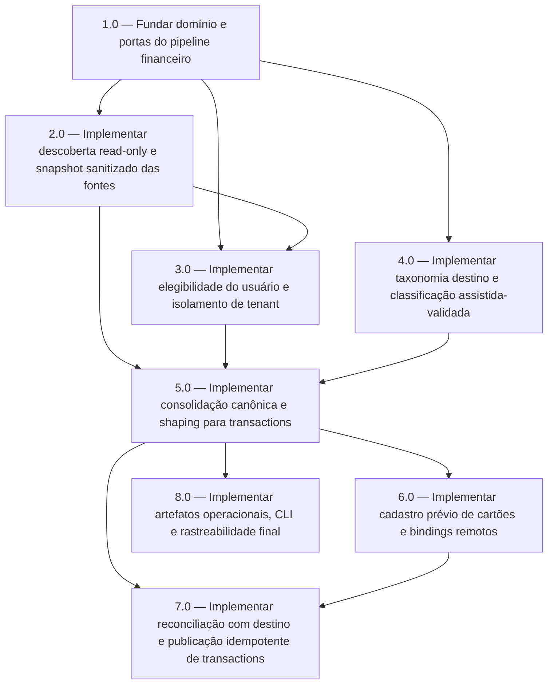

<!-- spec-hash-prd: bb463af4b673d04a6b3e3f52b9675a093c2c6d9bf5886e21974073d932b31e29 -->
<!-- spec-hash-techspec: 213798c6865bbb2c6fe393f85c72dd9765a5b41efd452729a4638edc402543e3 -->
# Resumo das Tarefas de Implementação para Descoberta e Consolidação do Domínio Financeiro Jailton

## Metadados
- **PRD:** `.specs/prd-descoberta-consolidacao-dominio-financeiro-jailton/prd.md`
- **Especificação Técnica:** `.specs/prd-descoberta-consolidacao-dominio-financeiro-jailton/techspec.md`
- **Total de tarefas:** 8
- **Tarefas paralelizáveis:** `3.0` com `4.0`; `6.0` com `8.0`

## Tarefas

| # | Título | Status | Dependências | Paralelizável | Skills |
|---|--------|--------|-------------|---------------|--------|
| 1.0 | Fundar domínio e portas do pipeline financeiro | done    | — | — | — |
| 2.0 | Implementar descoberta read-only e snapshot sanitizado das fontes | done | 1.0 | Não | — |
| 3.0 | Implementar elegibilidade do usuário e isolamento de tenant | done | 1.0, 2.0 | Com 4.0 | — |
| 4.0 | Implementar taxonomia destino e classificação assistida-validada | done    | 1.0 | Com 3.0 | — |
| 5.0 | Implementar consolidação canônica e shaping para transactions | done    | 2.0, 3.0, 4.0 | Não | — |
| 6.0 | Implementar cadastro prévio de cartões e bindings remotos | done | 5.0 | Com 8.0 | — |
| 7.0 | Implementar reconciliação com destino e publicação idempotente de transactions | done | 5.0, 6.0 | Não | — |
| 8.0 | Implementar artefatos operacionais, CLI e rastreabilidade final | done | 5.0 | Com 6.0 | — |

## Dependências Críticas
- `1.0` é a base obrigatória para o novo pipeline e para todas as fronteiras de domínio/aplicação.
- `2.0` precisa existir antes de `3.0` para que a elegibilidade use snapshots e leituras em escopo real.
- `3.0` e `4.0` podem evoluir em paralelo, mas `5.0` depende das duas para consolidar fatos já elegíveis e classificáveis.
- `6.0` depende de `5.0` porque a chave de negócio do cartão e os fatos ligados a cartão surgem do domínio consolidado.
- `7.0` depende de `6.0` porque transações de cartão exigem binding remoto consistente.
- `8.0` pode evoluir junto com `6.0` após `5.0`, sem bloquear o fluxo principal de publicação.

## Riscos de Integração
- O contrato real de `cards` e `transactions` no repositório `mecontrola` pode divergir do OpenAPI local ainda baseado em `/records`.
- A taxonomia de `income` pode não fechar a cobertura exigida pelo PRD, o que deve manter receitas bloqueadas sem abrir exceção silenciosa.
- O lookup remoto por chave de negócio pode exigir fallback maior para bindings locais e afetar a reconciliação `GET-before-POST`.
- A diferenciação determinística entre `pix`, `ted` e outros métodos bancários depende de sinais fortes da origem e pode exigir bloqueio frequente no início.

## Cobertura de Requisitos

| Tarefa | Requisitos cobertos |
|--------|-------------------|
| 1.0 | RF-06, RF-07, RF-08, RF-24, RF-25, RF-31, RF-32, RF-36, RF-37, RF-38 |
| 2.0 | RF-01, RF-02, RF-03, RF-04, RF-05, RF-27, RF-28, RF-29 |
| 3.0 | RF-09, RF-10, RF-11, RF-12, RF-13A, RF-23, RF-30 |
| 4.0 | RF-17, RF-18, RF-19, RF-20, RF-34, RF-38 |
| 5.0 | RF-06, RF-07, RF-08, RF-14, RF-15, RF-16, RF-24, RF-25, RF-31, RF-32, RF-33, RF-34, RF-35, RF-36, RF-37 |
| 6.0 | RF-13, RF-40 |
| 7.0 | RF-14, RF-16, RF-21, RF-22, RF-33, RF-39 |
| 8.0 | RF-08, RF-21, RF-22, RF-26, RF-28, RF-29, RF-39 |

## Grafo de Dependencias

## Legenda de Status
- `pending`: aguardando execução
- `in_progress`: em execução
- `needs_input`: aguardando informação do usuário
- `blocked`: bloqueado por dependência ou falha externa
- `failed`: falhou após limite de remediação
- `done`: completado e aprovado
